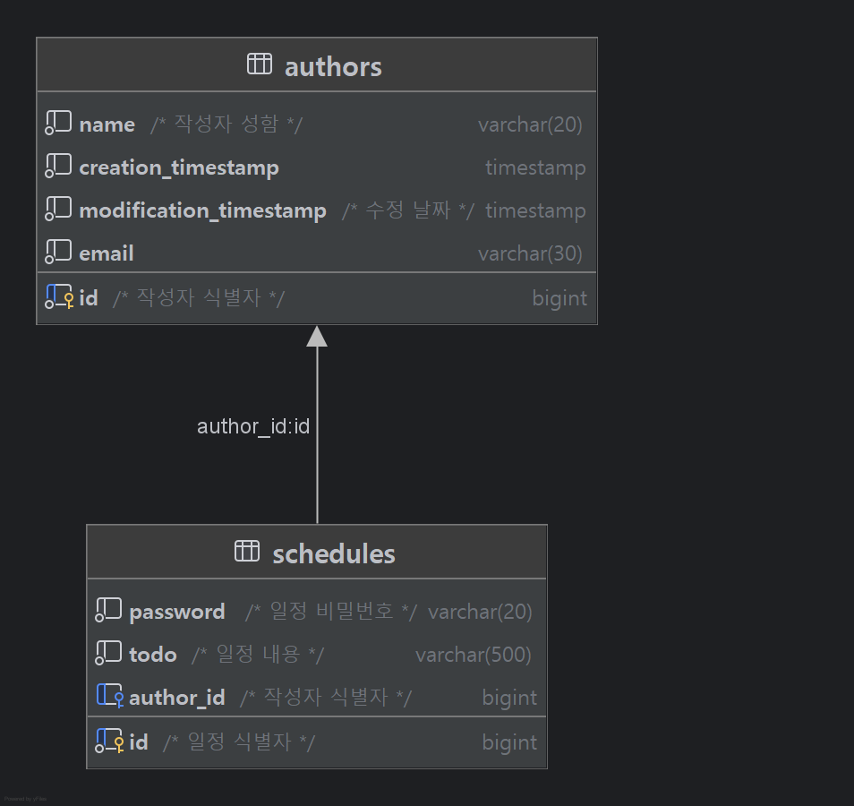

# Scheduler Web Application

## API Documents

## < 일정 생성 : Post >

일정을 생성하여 DB에 저장합니다.

### Request

#### 1. Request URL
localhost:8080/schedules

#### 2. RequestType : RequestBody

#### 3. Request Elements


| Parameter |  Type  | Required | Description |
|:---------:|:------:|:--------:|-------------|
|   name    | String |    O     | 작성자 명       |
| password  | String |    O     | 일정 비밀번호     |
|   email   | String |    O     | 작성자 Email   |
|   todo    | String |    O     | 일정 내용       |

### Response

#### 1. Content-Type : jason

#### 2. Response Example
```xml
{curl --location 'localhost:8080/schedules' \
--data-raw '{
    "name" : "홍길동",
    "password" : "qwer1234",
    "email" : "honggildong@google.com",
    "todo" : "인사하기"
}'
}
```
#### 3. Http Status Massage
|          Status           |   HttpStatus |         Message    |  
|:-------------------------:|:-----:|:------------------:|
|            등록             |   201 CREATED |            X       |
|        작성자명 = null        | 400 BAD_REQUEST | "작성자 명 필수로 입력해주셔야 합니다." |
|        비밀번호 = null        | 400 BAD_REQUEST | "비밀번호를 필수로 입력해주셔야 합니다." |
|    email 양식에 맞지 않을 경우     | 400 BAD_REQUEST |  "email 양식에 맞지 않습니다." |
|       email = null        |400 BAD_REQUEST|"Email을 필수로 입력해주셔야 합니다."|
|    일정 내용(@size > 200)     |400 BAD_REQUEST|  "일정 작성 제한은 200자입니다."|
|       일정 내용 = null        |400 BAD_REQUEST|"일정을 필수로 작성 해주셔야 합니다."|
| 각 Field와 다른 타입의 요청을 받을 경우 |400 BAD_REQUEST|"invalid request field value"|

## < 조건부 전체 일정 조회 : Get >

이름과 수정일을 조건으로 두어 조회 할 수 있습니다.

### Request

#### 1. Request URL
localhost:8080/schedules

#### 2. RequestType : RequestParam

#### 3. Request Elements

|    Parameter     |  Type  |      Required      | Description |
|:----------------:|:------:|:------------------:|:-----------:|
|       name       | String |         X          |    작성자명     |
| modificationdate | String | X<br/>(YYYY-MM-DD) |     수정일     |

### Response

#### 1. Content-Type

jason

#### 2. Response Example
```xml
[
        {
        "id": 13,
        "name": "James",
        "password": "abc1234",
        "email": "Jamesg@google.com",
        "todo": "Hi",
        "creationTimestamp": "2025-03-26T00:07:24",
        "modificationTimestamp": "2025-03-26T00:07:24"
        },
        {
        "id": 12,
        "name": "홍길동",
        "password": "qwer1234",
        "email": "honggildong@google.com",
        "todo": "인사하기",
        "creationTimestamp": "2025-03-25T18:56:18",
        "modificationTimestamp": "2025-03-25T18:56:18"
        },
        .......
]
```
#### 3. Http Status Massage
|           Status           |   HttpStatus    | Massage |  
|:--------------------------:|:---------------:|:-------:|
|             조회             |     200 OK      |    X    |
|     조회 결과가 존재하지 않을 경우      |                 |    X    |
| 조회 parameter 타입과 다른 요청의 경우 | 400 BAD_REQUEST |   "invalid request value"      |

## < 작성자 고유 식별 번호를 통한 조회 : Get >

작성자 고유 식별 번호를 조건으로 두어 조회 할 수 있습니다.

### Request

#### 1. Request URL
localhost:8080/schedules/{authorId}

#### 2. RequestType : PathVariable

#### 3. Request Elements

| PathVariable | Type | Required | Description  |
|:------------:|:----:|:--------:|--------------|
|   authorId   | Long |    O     | 작성자 고유 식별 번호 |


### Response

#### 1. Content-Type

jason

#### 2. Response Example
```xml
{
        "id": 10,
        "name": "홍길동",
        "password": "abcd123",
        "email": "abcd123@naver.com",
        "todo": "노래하기",
        "creationTimestamp": "2025-03-25T16:33:54",
        "modificationTimestamp": "2025-03-25T16:33:54"
        }
```
#### 3. Http Status Massage
|           Status           |  HttpStatus   | Massage |  
|:--------------------------:|:-------------:|:-------:|
|             조회             |    200 OK     |    X    |
|     조회 결과가 존재하지 않을 경우      | 404 NOT_FOUND | "요청하신 일정을 찾을 수 없습니다."|
|  작성자 식별 번호 타입과 다른 요청의 경우   | 400 BAD_REQUEST |   "invalid request value"|
|      작성자 식별 번호 = null      | 400 BAD_REQUEST |   "@Validated failed"|

## < 작성자 고유 식별 번호를 통한 일정 수정 : Patch >

작성자 고유 식별 번호를 조건으로 작성자 명과, 할일을 수정할 수 있습니다. 단, 일정 비밀번호가 일치하여야 합니다.

### Request

#### 1. Request URL
localhost:8080/schedules/{authorId}

#### 2. RequestType : PathVariable, RequstBody

#### 3. Request Elements

|          | RequestType  |  Type  | Required | Description  |
|:--------:|:--------:|:------:|:--------:|:------------:|
| authorId | PathVariable |  Long  |    O     | 작성자 고유 식별 번호 |
|   name   | RequestBod   | String |    X     |    작성자 이름    |
| password | RequestBody  | String |    O     |   일정 비밀 번호   |
|   todo   | RequestBody  | String |    X     |     할 일      |

### Response

#### 1. Content-Type

jason

#### 2. Response Example
```xml
{ //old
        "id": 8,
        "name": "박효성",
        "password": "abc123",
        "email": "abc123@naver.com",
        "todo": "공부하기",
        "creationTimestamp": "2025-03-25T16:32:40",
        "modificationTimestamp": "2025-03-25T16:32:40"
        }

{//new
        "id": 8,
        "name": "prem3",
        "password": "abc123",
        "email": "abc123@naver.com",
        "todo": "과제 제출하기",
        "creationTimestamp": "2025-03-25T16:32:40",
        "modificationTimestamp": "2025-03-26T12:34:40"
        }

```
#### 3. Http Status Massage
|             Status             |   HttpStatus    | Massage |  
|:------------------------------:|:---------------:|:-------:|
|               수정               |     200 OK      |    X    |
|수정 요청 일정이 존재하지 않는 경우|  404 NOT_FOUND  |"요청하신 일정을 찾을 수 없습니다."|
|비밀번호 = null| 400 BAD_REQUEST |  "비밀번호를 필수로 입력해주셔야 합니다."       |
| 요청 비밀 번호가 일정 비밀 번호와 일치하지 않는 경우 | 400 BAD_REQUEST | "잘못된 비밀번호 입니다." |
|작성자 식별 번호 타입과 다른 요청의 경우   | 400 BAD_REQUEST |   "invalid request value"|
|      작성자 식별 번호 = null      | 400 BAD_REQUEST |   "@Validated failed" |
|각 Field와 다른 타입의 요청을 받을 경우 |400 BAD_REQUEST|"invalid request field value"|

## < 작성자 고유 식별 번호를 통한 일정 삭제 : Delete >

작성자 고유 식별 번호를 조건으로 일정을 삭제 할 수 있습니다. 단, 일정 비밀번호가 일치하여야 합니다.


### Request

#### 1. Request URL
localhost:8080/schedules/{authorId}

#### 2. RequestType : PathVariable, RequestBody

#### 3. Request Elements

|          | RequestType  |  Type  | Required | Description  |
|:--------:|:--------:|:------:|:--------:|:------------:|
| authorId | PathVariable |  Long  |    O     | 작성자 고유 식별 번호 |
| password | RequestBody  | String |    O     |   일정 비밀 번호   |

### Response

#### Http Status Massage
|             Status             |  HttpStatus   |        Massage        |  
|:------------------------------:|:-------------:|:---------------------:|
|               삭제               |    200 OK     |           X           |
|      삭제 요청 일정이 존재하지 않는 경우      | 404 NOT_FOUND | "요청하신 일정을 찾을 수 없습니다." |
|          비밀번호 = null           | 400 BAD_REQUEST |  "비밀번호를 필수로 입력해주셔야 합니다."|
| 요청 비밀 번호가 일정 비밀 번호와 일치하지 않는 경우 | 400 BAD_REQUEST | "잘못된 비밀번호 입니다." |
|    작성자 식별 번호 타입과 다른 요청의 경우     | 400 BAD_REQUEST |   "invalid request value"|
|        작성자 식별 번호 = null        | 400 BAD_REQUEST |   "@Validated failed"|
|    Field와 다른 타입의 요청을 받을 경우     |400 BAD_REQUEST|"invalid request field value"|

## ERD

